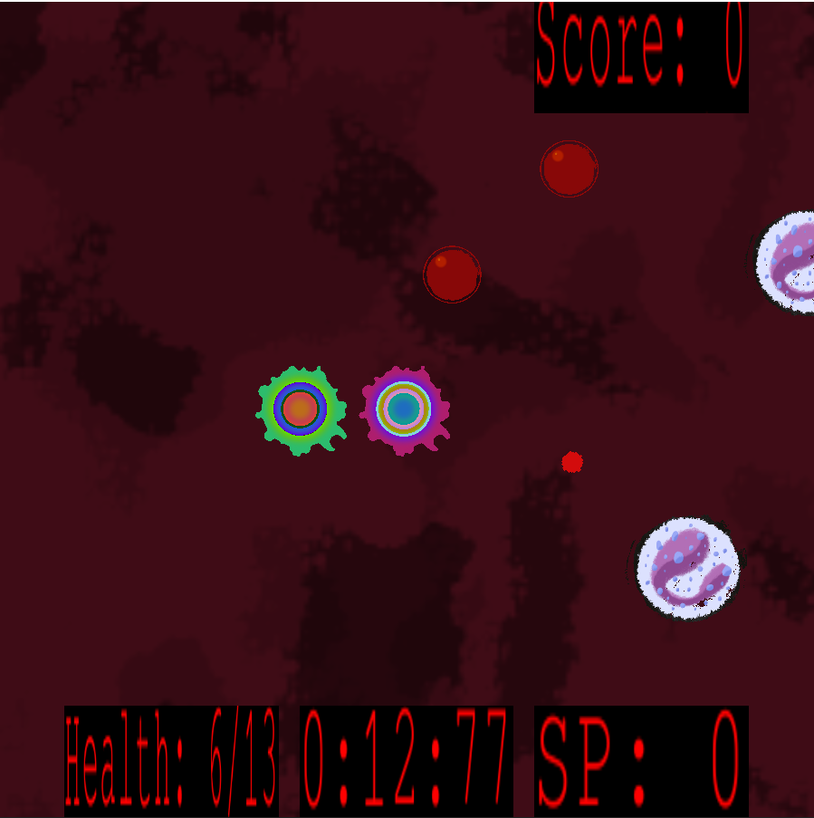

# 2501-Final-Project - Diagnosis: DEATH

Instead of focusing on good game design, as done in our usual projects, we prioritized learning and implementation.

This project contains code from the COMP2501 demos: 

Copyright (c) 2020-2023 Oliver van Kaick <Oliver.vanKaick@carleton.ca>, David Mould <mould@scs.carleton.ca>

under the MIT License.
